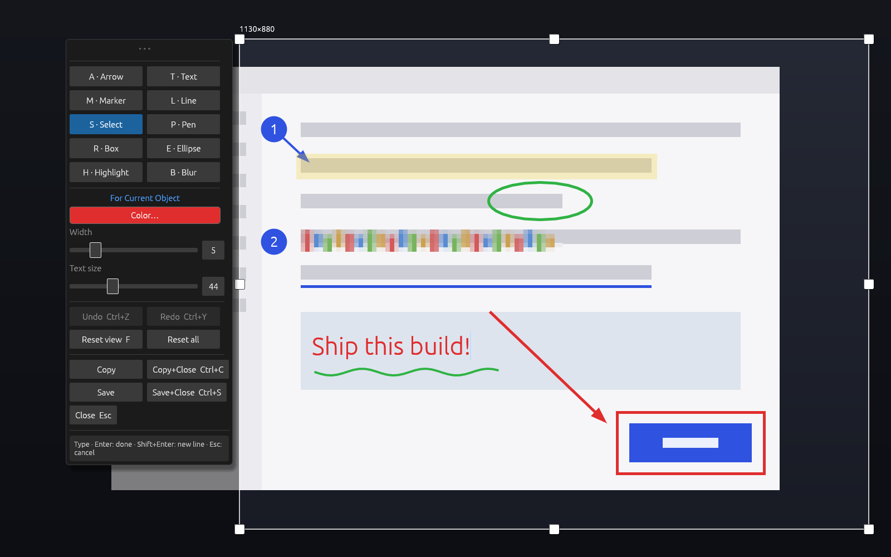
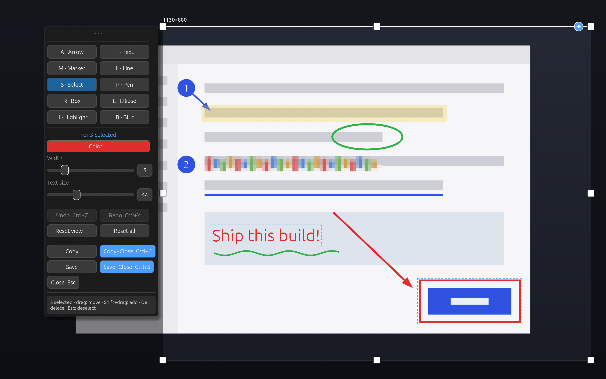

# scrannotate

> [!WARNING]
> ## ⚠️ AI-generated code
> This project contains **AI-generated code**. It was an effort to solve a
> specific problem quickly, and **does not represent what we consider to be
> quality software code**. Read, review, and use accordingly.

**Screen. Annotate. Done.**

scrannotate is a fast, keyboard-friendly screenshot annotation tool for
**Linux (Wayland), macOS, and Windows**. It grabs one screen per shot as a
**raw frame** — no image encoding, no disk round-trip, so the editor is up
in a blink. Select, annotate, and ship — copy to the clipboard or save a
PNG — without ever leaving that one surface. No editor window, no dialogs,
no save prompts.


## Highlights

- **Screens are numbers.** `scrannotate` captures screen 1, `--screen 2`
  captures screen 2, and so on — bind one hotkey per screen. On macOS and
  Windows the numbers simply follow the display list (`--pick-screen`
  prints it). On Linux, where Wayland's portal never lets an app pick a
  monitor itself, the first use of a number shows the desktop's monitor
  chooser once and remembers your pick (a persisted portal grant per slot),
  so every run after that is instant and silent; `--pick-screen` re-binds a
  slot.
- **One surface, no modes to escape.** The capture fills the screen with
  full-screen crosshairs; drag out the region (its edges extend as guide
  lines while you drag) and the toolbar snaps in beside it. The region stays
  adjustable — resize handles plus a move grip at its top-right — right up
  until you copy. The status line at the toolbar's foot always explains what
  the current state means and what a click will do.
- **Every annotation stays live.** Nothing is baked in until export. With
  the Select tool, click any placed item to move it, resize it with handles,
  rotate it with the knob, restyle it, or delete it. Drag a box over several
  to select them (Shift+drag adds to the selection; Ctrl+click toggles one)
  and move, restyle, or delete them together. Undo/redo throughout —
  including region changes.
- **Ten tools**: Select, Pen, Line, Arrow, Box, Ellipse, Highlight, Blur
  (pixelate), Text, and auto-numbered Markers — drag a marker and an arrow
  grows out of it (one object; each end drags independently).
- **Inline text.** Text is typed directly on the image in its final font and
  color — no popup editor — and never soft-wraps; lines break only where you
  press Shift+Enter. Double-click any text, with any tool, to edit it again.
- **Settings that know their target.** The toolbar's settings section is
  labeled "For Current Object" or "For New Objects" and shows the target's
  actual color/width/size. A large color picker keeps your recently used
  colors one click away.
- **Pixel-identical export.** The PNG/clipboard renderer (tiny-skia) shares
  its geometry with the on-screen renderer, so what you see is exactly what
  you ship — including rotated shapes and rotated text.
- **Respectful of your flow.** Copy (`Enter`/`Ctrl+C`) puts the region on
  the clipboard and closes; Save (`Ctrl+S`) writes a PNG and closes; `Esc`
  steps back and double-`Esc` discards — never a confirmation dialog.
  Preferences (recent colors, deliberately-set sizes) persist between runs.

## Install

### Prebuilt binaries

Every release publishes binaries on the
[GitHub Releases page](https://github.com/appcove/scrannotate/releases) for:

| Platform | Targets |
|----------|---------|
| Linux (glibc 2.39+, e.g. Ubuntu 24.04+) | `x86_64-unknown-linux-gnu`, `aarch64-unknown-linux-gnu` |
| macOS | `aarch64-apple-darwin` (Apple silicon), `x86_64-apple-darwin` (Intel) |
| Windows | `x86_64-pc-windows-msvc`, `aarch64-pc-windows-msvc` |

Archive names follow cargo-binstall's convention, so
`cargo binstall scrannotate` also works. Each asset ships a `.sha256`
checksum.

Platform wrinkles for downloaded binaries:

- **macOS**: the binaries are ad-hoc signed, not notarized (no Apple
  Developer account). A browser-downloaded archive is quarantined — either
  approve the app under *System Settings → Privacy & Security → "Open
  Anyway"* after the first blocked launch, or clear the flag yourself:
  `xattr -d com.apple.quarantine ./scrannotate`. Downloads via
  `curl … | tar xz` are never quarantined.
- **Windows**: the binaries are unsigned, so SmartScreen interjects on
  first run — *More info → Run anyway*. (Machines with Smart App Control
  enabled block unsigned binaries outright.)

### Building from source

Rust 1.88+. On Linux the capture backend builds against PipeWire:

```
sudo apt install libpipewire-0.3-dev clang pkg-config   # needs PipeWire 1.x, e.g. Ubuntu 24.04+
```

macOS and Windows need no system packages — just a Rust toolchain.

```
cargo build --release
```

(`cargo build --no-default-features` skips the capture backend — only
`--from-file` works then; useful for developing the UI on a machine without
PipeWire headers.)

## Platform notes

### Linux

Runtime: PipeWire and xdg-desktop-portal (present on any GNOME, KDE, or
wlroots desktop), plus `wl-clipboard` — copying spawns `wl-copy`, whose
forked child keeps serving the clipboard after scrannotate quits (a Wayland
clipboard normally dies with its owner). Without it, copy falls back to an
in-process clipboard that only survives if a clipboard manager grabs it.

Bind it to your screenshot key (e.g. in GNOME: Settings → Keyboard →
Custom Shortcuts → `scrannotate` on `Print`).

### macOS

macOS 12.3+ (ScreenCaptureKit). The first capture triggers the **Screen
Recording** permission prompt. macOS attributes that permission to the app
that *launched* the process — run scrannotate from Terminal and it is
Terminal that needs the grant; launch it from a hotkey tool (Raycast,
Hammerspoon, a Shortcuts binding) and that tool holds the grant, once,
covering every capture after it. Expect macOS 15+ to re-confirm
screen-recording apps roughly monthly; every capture tool gets the same
treatment. Keyboard shortcuts read as `Ctrl` below but are the `⌘` key on
macOS.

### Windows

Windows 10 1903+ (Windows Graphics Capture, with a DXGI fallback — note the
fallback cannot embed the `--cursor` pointer). On Windows 10 the system may
flash its yellow capture border for the instant of the shot; Windows 11
suppresses it. HDR displays currently capture in SDR (washed-out colors) —
a known limitation of BGRA8 capture. Bind a hotkey via a shortcut file's
*Properties → Shortcut key*, PowerToys, or AutoHotkey.

## Usage

```
scrannotate                      # capture screen 1, select a region, annotate in place
scrannotate --screen 2           # capture screen 2
scrannotate --pick-screen        # Linux: re-bind what "screen N" means; macOS/Windows: list screens
scrannotate --cursor             # include the mouse cursor in the capture
scrannotate --delay 3            # wait 3s before capturing (open that menu first)
scrannotate --save-path DIR      # where Ctrl+S saves (default ~/Pictures/Screenshots)
scrannotate --from-file img.png  # annotate an existing image (no capture)
```

On Linux, the first use of each screen slot shows the desktop's
screen-share dialog — that's where you decide which monitor the number
means; the granted portal token is saved per slot, so subsequent captures
skip it. On macOS and Windows there is no dialog: screen numbers follow the
display list, primary first. Bind hotkeys to taste: `Print` →
`scrannotate`, `Shift+Print` → `scrannotate --screen 2`.

### The flow

1. **Select** — the frozen frame appears with a crosshair under the cursor.
   Drag out the region; while dragging, the box edges extend across the
   whole screen so you can align both corners precisely. The region can be
   redrawn at any time (right-drag, with any tool), moved by the grip at its
   top-right, or resized by its handles with the Select tool.
2. **Annotate** — the toolbar (draggable by its `• • •` grip) has the tools
   two per row, Arrow/Text/Marker/Line first. Pick one and draw. Markers
   drop with a click, or drag one to pull an arrow out of it. Text is typed
   inline; Shift+Enter for new lines.

   

3. **Refine** — tap `Space` (or `S`) for the Select tool: hover highlights
   what's clickable; click an item to select it, drag an item to move it,
   drag empty space to rubber-band a selection box around several, handles
   resize, the curved-arrow knob rotates, the four-arrow knob moves text,
   `Del` deletes. `Shift+drag` adds the box's contents to the selection
   (`Ctrl+click` toggles one item, `Ctrl+A` selects everything); moving,
   restyling, and deleting apply to the whole selection. The settings panel
   edits whatever is selected — or the defaults when nothing is.

   

4. **Ship** — `Enter`/`Ctrl+C` copies the region and closes; `Ctrl+S` saves
   a PNG and closes; the toolbar also has plain Copy/Save buttons that keep
   the editor open. `Esc Esc` discards everything, no questions asked.

### Keys

On macOS, `Ctrl` in this table is the `⌘` Command key.

| Tool | Key | | Action | Key |
|------|-----|-|--------|-----|
| Select | `S` / tap `Space` | | Copy & close | `Enter` / `Ctrl+C` |
| Pen | `P` | | Save & close | `Ctrl+S` |
| Line | `L` | | Undo / Redo | `Ctrl+Z` / `Ctrl+Shift+Z` |
| Arrow | `A` | | Delete selection | `Del` / `Backspace` |
| Box | `R` | | Select box (Shift adds) | drag / `Shift`+drag |
| Ellipse | `E` | | Toggle one in/out of selection | `Ctrl`+click |
| Highlight | `H` | | Select all | `Ctrl+A` |
| Blur | `B` | | Reset view | `F` |
| Text | `T` | | Cancel op → clear selection → Select tool → `Esc` `Esc` discards | `Esc` |
| Marker | `M` | | Quit | `Ctrl+Q` |
| | | | Zoom / Pan | scroll / middle drag, `Space`+drag |
| | | | Move region / New region | top-right grip / right drag |
| | | | Reset all (back to region select) | `Shift+Esc` |

### The color picker

Click the color swatch in the toolbar's settings section:


Recently used colors form a most-recently-used stack (clicking one loads it
into the picker), and colors you actually draw with bubble to its head. The
recents — plus stroke width and text size once you've deliberately adjusted
them — persist between runs in a small state directory:
`$XDG_STATE_HOME/scrannotate` on Linux (default
`~/.local/state/scrannotate`), `~/Library/Application Support/scrannotate`
on macOS, `%LOCALAPPDATA%\scrannotate` on Windows. Untouched sizes stay
resolution-scaled defaults.

## How it works

Capture runs through [pinray] on every platform — one streaming session,
one frame taken, no encoding:

- **Linux**: Wayland doesn't let applications read the screen directly, so
  scrannotate asks the **XDG Desktop Portal** for a `ScreenCast` stream
  (`src/capture/screencast.rs`, PipeWire) — raw RGBA over shared memory.
  Each screen slot's grant persists via a portal restore token, so only a
  slot's first use shows the chooser.
- **macOS**: **ScreenCaptureKit** (`src/capture/monitor.rs`), picking the
  display by its ID.
- **Windows**: **Windows Graphics Capture** with a DXGI desktop-duplication
  fallback (`src/capture/monitor.rs`).

The frame is shown frozen in a fullscreen window on the monitor it came
from; everything you do happens on that frozen frame. (On macOS that means
winit's *simple fullscreen* — instant, in place — rather than the native
fullscreen that animates onto its own Space.)

Inside the app, the frozen frame lives in a `Document` (annotations with
stable ids, the region, and transactional undo — `src/document.rs`), and
all pointer interaction runs through a single state machine
(`src/editor/state.rs`): exactly one interaction — drawing, region drag,
item drag, rubber-band, text edit, pan — can be active, so conflicting
drags are unrepresentable and every state defines its own Esc/cancel.
Annotations stay vector objects until export, when a **tiny-skia**
rasterizer that shares geometry with the on-screen egui renderer draws them
into the final PNG.

One workaround worth knowing about: pinray 0.2.4 only *logs* the portal
restore token instead of returning it, so `src/capture/screencast.rs`
catches it with a tracing layer. Drop that when pinray exposes the token.

[pinray]: https://crates.io/crates/pinray

## Running inside a container (development)

On Linux, capture needs the host's **session D-Bus** socket (PipeWire
itself arrives as a file descriptor over the portal's
`OpenPipeWireRemote`):

```
docker run ... \
  -v $XDG_RUNTIME_DIR/wayland-0:/run/user/1000/wayland-0 \
  -v $XDG_RUNTIME_DIR/bus:/run/user/1000/bus \
  -e WAYLAND_DISPLAY=wayland-0 \
  -e DBUS_SESSION_BUS_ADDRESS=unix:path=/run/user/1000/bus
```

Without the bus mount, `--from-file` still works (annotation only), and the
UI can be exercised headlessly under Xvfb — see
[CONTRIBUTING.md](CONTRIBUTING.md).

## Contributing

See [CONTRIBUTING.md](CONTRIBUTING.md) — note that submissions transfer
their IP to the project (contributions are copyright-assigned, and the
project is distributed under Apache 2.0).

## License

[Apache License 2.0](LICENSE) — Copyright 2026 AppCove, Inc.
