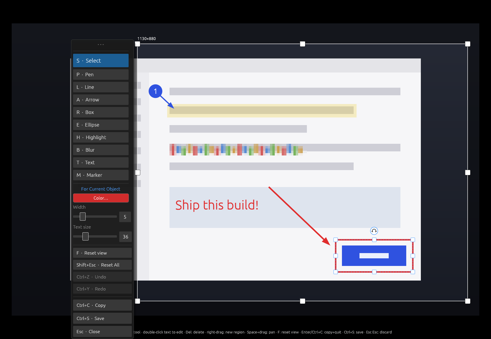
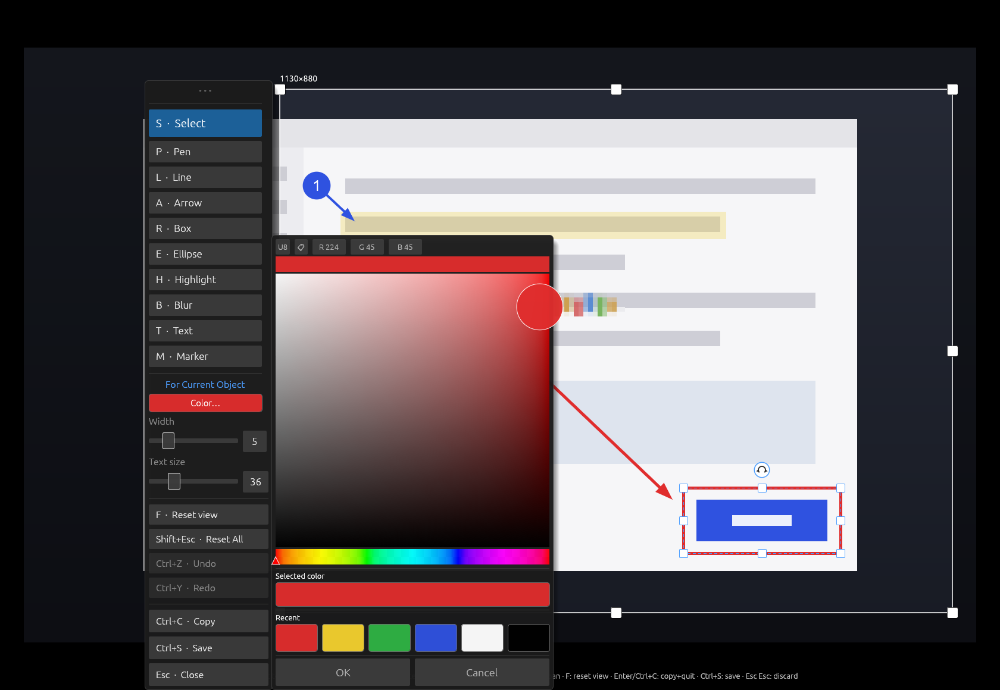

# scrannotate

**Screen. Annotate. Done.**

scrannotate is a fast, keyboard-friendly screenshot annotation tool for
Wayland. It captures your screen through the XDG Desktop Portal, freezes the
frame fullscreen, and lets you select, annotate, and ship — copy to the
clipboard or save a PNG — without ever leaving that one surface. No editor
window, no dialogs, no save prompts.



## Highlights

- **One surface, no modes to escape.** The capture fills the screen with
  full-screen crosshairs; drag out the region (its edges extend as guide
  lines while you drag) and a toolbar appears beside it. The region stays
  adjustable — with its own handles — right up until you copy.
- **Every annotation stays live.** Nothing is baked in until export. With
  the Select tool, click any placed item to move it, resize it with handles,
  rotate it with the knob, restyle it, or delete it. Undo/redo throughout.
- **Ten tools**: Select, Pen, Line, Arrow, Box, Ellipse, Highlight, Blur
  (pixelate), Text, and auto-numbered Markers — drag a marker and an arrow
  grows out of it (one object; each end drags independently).
- **Inline text.** Text is typed directly on the image in its final font and
  color — no popup editor — and never soft-wraps; lines break only where you
  press Shift+Enter. Double-click any text, with any tool, to edit it again.
- **Settings that know their target.** The toolbar's settings section is
  labeled "For Current Object" or "For New Objects" and shows the target's
  actual color/width/size. A large color picker keeps your recently used
  colors one click away.
- **Pixel-identical export.** The PNG/clipboard renderer (tiny-skia) shares
  its geometry with the on-screen renderer, so what you see is exactly what
  you ship — including rotated shapes and rotated text.
- **Respectful of your flow.** Copy (`Enter`/`Ctrl+C`) puts the region on
  the clipboard and quits; Save (`Ctrl+S`) writes a PNG instantly and stays
  open; `Esc` steps back and double-`Esc` discards — never a confirmation
  dialog. Preferences (recent colors, deliberately-set sizes) persist
  between runs.

## Install

Linux with Rust 1.88+. Build dependencies:

```
sudo apt install libpipewire-0.3-dev clang pkg-config
```

Runtime: PipeWire and xdg-desktop-portal (present on any GNOME, KDE, or
wlroots desktop), plus `wl-clipboard` — copying spawns `wl-copy`, whose
forked child keeps serving the clipboard after scrannotate quits (a Wayland
clipboard normally dies with its owner). Without it, copy falls back to an
in-process clipboard that only survives if a clipboard manager grabs it.

```
cargo build --release
install -Dm755 target/release/scrannotate ~/.local/bin/scrannotate
```

Bind it to your screenshot key (e.g. in GNOME: Settings → Keyboard →
Custom Shortcuts → `scrannotate` on `Print`).

## Usage

```
scrannotate                      # capture, select a region, annotate in place
scrannotate --full               # start with the whole screen already selected
scrannotate --delay 3            # wait 3s before capturing (open that menu first)
scrannotate --cursor             # include the mouse cursor in the capture
scrannotate --pick-monitor       # re-open the monitor chooser (otherwise the saved grant is reused)
scrannotate --from-file img.png  # annotate an existing image (no capture)
scrannotate --from-file img.png --region   # …starting at region selection
scrannotate --output DIR         # where Ctrl+S saves (default ~/Pictures/Screenshots)
```

The first capture shows the desktop's screen-share dialog (that's also where
you pick the monitor); the granted portal token is saved so subsequent
captures skip it. To capture a different monitor, use `--pick-monitor` or
the small "Change screen…" button at the top of the selection screen.

### The flow

1. **Select** — the frozen frame appears with a crosshair under the cursor.
   Drag out the region; while dragging, the box edges extend across the
   whole screen so you can align both corners precisely. The region can be
   moved, resized, or redrawn (right-drag anywhere) at any time.
2. **Annotate** — the toolbar appears beside the region (drag its `• • •`
   grip to move it). Pick a tool and draw. Markers drop with a click, or
   drag one to pull an arrow out of it. Text is typed inline; Shift+Enter
   for new lines.
3. **Refine** — tap `Space` (or `S`) for the Select tool: hover highlights
   what's clickable; click to select, drag to move, handles resize, the
   curved-arrow knob rotates, the four-arrow knob moves text, `Del`
   deletes. The settings panel edits whatever is selected — or the defaults
   when nothing is.
4. **Ship** — `Enter`/`Ctrl+C` copies the region and quits. `Ctrl+S` saves a
   PNG and keeps going. `Esc Esc` discards everything, no questions asked.

### Keys

| Tool | Key | | Action | Key |
|------|-----|-|--------|-----|
| Select | `S` / tap `Space` | | Copy & quit | `Enter` / `Ctrl+C` |
| Pen | `P` | | Save PNG (stays open) | `Ctrl+S` |
| Line | `L` | | Undo / Redo | `Ctrl+Z` / `Ctrl+Shift+Z` |
| Arrow | `A` | | Delete selected item | `Del` / `Backspace` |
| Box | `R` | | Reset view | `F` |
| Ellipse | `E` | | Cancel op → Select tool → `Esc` `Esc` discards | `Esc` |
| Highlight | `H` | | Quit | `Ctrl+Q` |
| Blur | `B` | | Zoom | scroll |
| Text | `T` | | Pan | middle drag / `Space`+drag |
| Marker | `M` | | New region | right drag |
| | | | Reset all (back to region select) | `Shift+Esc` |

### The color picker

Click the color swatch in the toolbar's settings section:



Recently used colors form a most-recently-used stack (clicking one loads it
into the picker), and colors you actually draw with bubble to its head. The
recents — plus stroke width and text size once you've deliberately adjusted
them — persist in `$XDG_STATE_HOME/scrannotate/prefs`; untouched sizes stay
resolution-scaled defaults.

## How it works

Wayland doesn't let applications read the screen directly, so scrannotate
asks the **XDG Desktop Portal** for a screencast stream (via
[pinray]/PipeWire), takes a single frame, and shows it frozen in a
fullscreen window — everything you do happens on that frozen frame.
Annotations live as vector objects until export, when a **tiny-skia**
rasterizer that shares geometry with the on-screen egui renderer draws them
into the final PNG.

One workaround worth knowing about: pinray 0.2.4 only *logs* the portal
restore token instead of returning it, so `capture.rs` catches it with a
tracing layer. Drop that when pinray exposes the token properly.

[pinray]: https://crates.io/crates/pinray

## Running inside a container (development)

Capture needs the host's **session D-Bus** socket (PipeWire itself arrives
as a file descriptor over the portal's `OpenPipeWireRemote`):

```
docker run ... \
  -v $XDG_RUNTIME_DIR/wayland-0:/run/user/1000/wayland-0 \
  -v $XDG_RUNTIME_DIR/bus:/run/user/1000/bus \
  -e WAYLAND_DISPLAY=wayland-0 \
  -e DBUS_SESSION_BUS_ADDRESS=unix:path=/run/user/1000/bus
```

Without the bus mount, `--from-file` still works (annotation only), and the
UI can be exercised headlessly under Xvfb — see
[CONTRIBUTING.md](CONTRIBUTING.md).

## Contributing

See [CONTRIBUTING.md](CONTRIBUTING.md) — note that submissions transfer
their IP to the project (contributions are copyright-assigned, and the
project is distributed under Apache 2.0).

## License

[Apache License 2.0](LICENSE) — Copyright 2026 Jason Garber.
